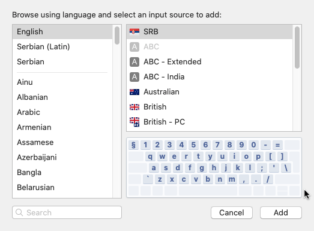

# RS Alternativni tastaturni raspored

Uobičajeni srpski latinični tastaturni raspored (engl: _keyboard layout_) ima dva problema:

+ specifična srpska slova (`š`, `ć`, `ž` itd.) se nalaze na mestu znakova koji se učestalo koriste u programiranju: `[`, `]`, `:`, `"` itd.
+ raspored ostalih znakova, naročito onih koji se nalaze u prvom, numeričkom redu tastature, je potpuno izmenjen u odnosu na US tastaturni raspored, kao na primer: zagrade, znak pitanja i slično.

_Alternativni_ tastaturni raspored napravljen sa sledećim početnim postavkama:

+ izmena mora biti **minimalna**: modifikuje se _što manji_ broj tastera.
+ specifična srpska dodatna slova se smatraju **dopunom** na osnovni raspored, te se ona _uključuju po potrebi_.
+ uključivanje dodatnih srpskih slova mora biti ergonomski i jednostavno.

Na ovaj način dobijamo raspored koji predstavlja **proširenje** uobičajenog; tako da treba memorisati pozicije samo dodatih slova.

## Definicija Rasporeda

| Kombinacija tastera | Srpsko slovo |
| ------------------- | ------------ |
| `⌥ + [`             | `š`          |
| `⌥ + ]`             | `đ`          |
| `⌥ + \`             | `ž`          |
| `⌥ + ;`             | `;`          |
| `⌥ + '`             | `'`          |

Velika slova se dobijaju očekivano: kada se uključe sa `SHIFT`.

Napomena: `⌥` predstavlja `Alt`/`Option` taster.

## Instalacija na OSX (Mac)

+ Preuzmi [SRB.bundle](osx/SRB.bundle.zip).
+ Otpakuj arhivu.
+ Smesti ga u `~/Library/Keyboard Layouts` folder.
+ Izloguj se i uloguj se ponovo.
+ Otvori `System Preferences > Keyboard > Input Sources`.
+ Dodaj `SRB` kao _Input Source_.

+ Raspored je izlistan:

