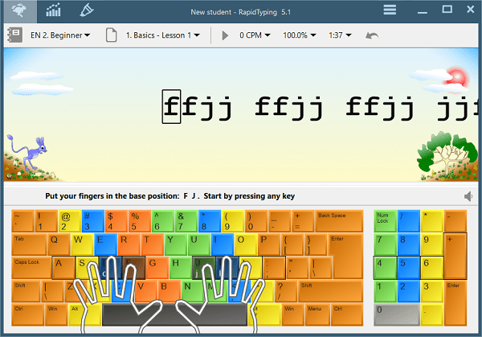

# Slepo kucanje - obuka osnovaca

Program "Slepo kucanje" je nastao kao ideja učiteljice Ane Maravić iz OŠ "Jovan Dučić" sa Novog Beograda. Kako deca uče slova iz bukvara (ćirlicu, pa potom latinicu), tako u isto vreme uče da kucaju ista ta slova na tastaturi. Pri tome se vodi računa da deca sede pravilno, kao i da probaju da koriste sve prste za kucanje.

Program je realizovan **2012-14**.

## CILJ

+ Učenje slova ćirilice i latinice,
+ Upoznavanje sa rasporedom tastera,
+ Dostizanje upotrebljive brzine i tačnosti kucanja.

Dodatno:

+ Prvi kontakt sa računarskim sistemom,
+ Korišćenje programa za crtanje Paint.

## UVODNI ČAS

Pre susreta sa računarom, drži se jedan-dva uvodna časa. Deci se pokazuje kako tastatura izgleda. Dele se papiri na kojima je odštampana "prazna" tastatura ([primer1](blank-keyboard.png), [primer2](blank-keyboard.svg)). Deca boje tastere žutom, plavom, narandžastom i zelenom bojom. Obeležavaju crticom tipke koja imaju ispupčenja (`FJ`) i objašnjava im se čemu služe. Pokazuje se tipka za razmak između reči. Papiri se zatim ubacuju u plastične folije radi zaštite. Objašnjava se kako se broje prsti: za palčeve kažemo da su prvi, za kažiprste drugi, za srednje prste treći, domali je četvrti, a najmanji je peti. Vežba se isto. Na kraju, deca postavljaju ruke i prste na papir i oponašaju kucanje.

## UČENJE SLOVA

Plan predviđa da svaka lekcija kucanja uključi po dva (nova) slova. Pred svaki rad na računaru, deci se pokazuje gde se nova slova nalaze. Deca zapisuju ta slova na papiru-tastaturi običnom olovkom, zatim crnim tankim flomasterom. Objašnjava se kojim se slovom kucaju nova slova. Deca vežbaju slova na foliji. Potom tek pristupaju programu na računaru.

Jedan od prvih časova je predviđen i za učenje posebnih tastera i znakova. Od znakova tu su znaci interpukcije. Od posebnih tastera skreće se pažnja na taster Shift kojim se kucaju velika slova. Objašnjava se postupak kucanja velkih slova: prvo se pritisne i drži Shift, a potom se kuca slovo koje žele da bude veliko.

Jedna lekcija kucanja na računaru traje oko 20-30 minuta. Svaka lekcija se ponavlja dva puta.

Kada se pređu lekcije svih slova, deca kucaju kraće tekstove iz Bukvara.

## CRTANJE

Deca koja pre ostalih uspešno završe sa lekcijom ponekad mogu da crtaju u kompjuterskom programu Paint. Ponekada, raznovrsnosti radi, deci se zadaju zadaci koje treba da nacrtaju - pošto se crtanje radi sklapanjem geometrijskih figura (na pr: jelka = trouglovi i pravougaonik). Uvek se zahteva i ispisavanje neke poruke na slici, kao primena stečenog znanja u kucanju.

## PROGRAM

Za obuku se korisiti bilo koji dostupan program za brzo kucanje. Međutim, plan po kome program radi se mora promeniti, pošto deca uče slova različitim redosledom nego što je uobičajeno u programima za brzo kucanje.

Za Windows platformu preporučeni program je: [RapidTyping 5](http://www.rapidtyping.com/downloads.html). Program je besplatan, postoji i u tkzv portable varijanti. Najvažnije je da je lak za upotrebu i vizuelno vrlo prilagođen deci - ekran je šaren i zabavan, ali ne ometa pisanje. Postoji i prevod programa na srpski, čime se još više olakšava okruženje. Na kraju svake lekcije prikazuje statistiku, koja je zgodna kao nagrada detetu.

## PLAN

Kompletan plan se nalazi u ovom folderu. Plan za ćirilicu je dat u tekstualnoj formi, ali i u formi prilagođenoj programu RapidTyping.

Sadržaj je objavljen pod [Creative Commons 4 licenceom](https://creativecommons.org/licenses/by/4.0/).
